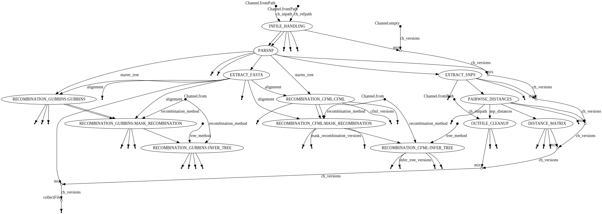

# Assembly SNPs Workflow


## Workflow overview
1. Identify all FastA assembly files in a given input path
    - recognized extensions are:  fa, fasta, fas, fna, fsa, fa.gz, fasta.gz, fas.gz, fna.gz, fsa.gz
2. Create a tmp dir and decompress, copy the assembly files with file extensions removed from all sample names
3. Run parsnp, which generates a phylogenetic tree "parsnp.tree"
    - optionally specify the reference file using `--reference <FILE>`; otherwise largest filesize is chosen automatically as the reference file
4. Extract a FastA file "SNPs.fa" with harvesttools of all samples with only the SNP positions
5. Perform all pairwise comparisons to tabulate the number of SNPs each sample pair have between them
6. Generate a matrix table summarizing pairwise distances between all samples
7. Optionally, classify SNPs as being due to recombination and re-estimate phylogenetic tree without these SNPs


*A schematic of the steps in the workflow.*

## Requirements
* [Nextflow](https://www.nextflow.io/docs/latest/)
* [Conda](https://docs.conda.io/en/latest/), [Docker](https://www.docker.com/), or [Singularity](https://sylabs.io/)

## Install
```
# This creates a subdirectory called `wf-assembly-snps` containing the workflow code in your current directory
git clone https://github.com/chrisgulvik/wf-assembly-snps.git

# Enter the workflow directory
cd wf-assembly-snps
```

[//]: # (## Run with conda)

[//]: # (```)

[//]: # (# make conda and nextflow available for use)

[//]: # (module load conda nextflow)

[//]: # (# run workflow)

[//]: # (nextflow run main.nf --outpath OUTPATH_DIR --inpath INPUT_DIR -with-dag flow.png)

[//]: # (```)

## Run workflow
For Aspen or other Univa Gride Engine users, skip to the quick start instructions [below](#quick-start-for-uge-users).

Before running, make sure you have Nextflow and Docker or Singularity installed.

The below run commands assume you are still in the workflow code directory `wf-assembly-snps`.
```
# View the help menu with a list of options
nextflow run main.nf --help
```
This yields:
```
N E X T F L O W  ~  version 21.10.6
Launching `main.nf` [big_bernard] - revision: 876ab2e244

=========================================
 wf-assembly-snps v1.0.0
=========================================

Usage:
The minimal command for running the pipeline is:
nextflow run main.nf
A more typical command for running the pipeline is:
nextflow run -profile singularity main.nf --inpath INPUT_DIR --outpath OUTPATH_DIR

Input/output options:
  --inpath             Path to input data directory containing FastA assemblies. Recognized extensions are:  fa, fasta, fas, fna, fsa, fa.gz, fasta.gz, fas.gz, fna.gz, fsa.gz.
  --outpath            The output directory where the results will be saved.
Analysis options:
  --curated-input      Whether or not input is a curated genome directory. If true, will assemue all genomes are similar enough to return sensible results. Options are: true (default), false.
  --recombination      Use a program to classify SNPs as due to recombination. Options are: gubbins, cfml, both.
  --reinfer-tree-prog  Program used to re-infer tree without SNPs classified as due to recombination. Options are: fasttree (default), raxml.
  --max-partition-size Max partition size (in bases, limits ParSNP memory usage). Note: results can change slightly depending on this value. Default is: 15000000.
Profile options:
  -profile singularity Use Singularity images to run the workflow. Will pull and convert Docker images from Dockerhub if not locally available.
  -profile docker      Use Docker images to run the workflow. Will pull images from Dockerhub if not locally available.
  -profile conda       TODO: this is not implemented yet.
Other options:
  -resume              Re-start a workflow using cached results. May not behave as expected with containerization profiles docker or singularity.
  -stub                Use example output files for any process with an uncommented stub block. For debugging/testing purposes.
  -name                Name for the pipeline run. If not specified, Nextflow will automatically generate a random mnemonic
```

To run the workflow, replace `INPATH_DIR` with the path to a directory of assembly files you want to analyze.
Replace `OUTPATH_DIR` with the path to a directory to store analysis results. The workflow will create this directory, or add/overwrite files in it if it already exists.

```
# Run with Singularity
nextflow run -profile singularity main.nf --outpath OUTPATH_DIR --inpath INPUT_DIR

# Run with Docker
nextflow run -profile docker main.nf --outpath OUTPATH_DIR --inpath INPUT_DIR
```

## Workflow output
```
# View final output file
cat OUTPATH_DIR/SNP-distances.matrix.tsv

# View final output dir structure
tree -a OUTPATH_DIR/
```

This yields:
```
-   16-090  16-100  16-127  16-146  16-151  16-155
16-090  0   31  24  7   32  35
16-100  31  0   33  32  3   6
16-127  24  33  0   25  34  37
16-146  7   32  25  0   33  36
16-151  32  3   34  33  0   3
16-155  35  6   37  36  3   0
```

```
OUTPATH_DIR/
|-- .log
|   |-- stderr.nextflow.txt
|   |-- stdout.nextflow.txt
|   `-- versions.txt
|-- clonalframeml
|   |-- clonalframeml.importation_status.txt
|   |-- clonalframeml.labelled_tree.newick
|   |-- clonalframeml_masked_recombination.fasta
|   `-- clonalframeml_masked_recombination.tree
|-- gubbins
|   |-- gubbins.node_labelled.final_tree.tre
|   |-- gubbins.recombination_predictions.gff
|   |-- gubbins_masked_recombination.fasta
|   `-- gubbins_masked_recombination.tree
|-- parsnp
|   |-- SNP-distances.matrix.tsv
|   |-- SNP-distances.pairs.tsv
|   |-- SNPs.fa
|   |-- parsnp.fasta
|   |-- parsnp.ggr
|   |-- parsnp.tree
|   `-- parsnp.xmfa
|-- pipeline_dag.2022-02-18\ 12:52:15.svg
|-- report.2022-02-18\ 12:52:15.html
|-- timeline.2022-02-18\ 12:52:15.html
`-- trace.2022-02-18\ 12:52:15.txt
```
Nextflow produces many intermediate files that can waste space. Remove these files with:
```
# Clean up intermediate files, retain output
rm -rf .nextflow .nextflow.log* work/
```
## Quick start for UGE Users
If you are a user of the Apsen cluster (which employs the Univa Grid Engine batch-queueing system), you can call this workflow using a wrapper script.

The wrapper script requires wf-assembly-snps to be installed in a location `$LAB_HOME/workflows/`, where `$LAB_HOME` is an environment variable set in your bash configuration file. 
The following are one-time steps to define this environment variable and make the script executable:
```
# Check if you already have LAB_HOME set:
echo $LAB_HOME  # Is this varible set?
cat $HOME/.bashrc  # Do you set LAB_HOME anywhere in your bash configuration file?
```
If you already have this variable set, move wf-assembly-snps to `$LAB_HOME/workflows`:
```
cd ../
mkdir -p $LAB_HOME/workflows
mv wf-assembly-snps $LAB_HOME/workflows/
```
If not, set LAB_HOME to be your `$HOME` directory and put wf-assembly-snps there.
```
cd ../
mkdir -p $HOME/workflows
mv wf-assembly-snps $HOME/workflows/
echo "export LAB_HOME=$HOME" >> $HOME/.bashrc
```
Finally, make the wrapper script executable and add its location to your `PATH` variable.
```
chmod u+x $LAB_HOME/workflows/wf-assembly-snps/run_parsnp.uge-nextflow
echo "export PATH=\$PATH:$LAB_HOME/workflows/wf-assembly-snps" >> $HOME/.bashrc
```
Re-start your session.

After this one-time set-up is complete, you will only need to call the script to run the workflow each time you have new data to analyze.
To run the workflow, replace INPATH_DIR with the path to a directory of assembly files you want to analyze. Replace OUTPATH_DIR with the path to a directory to store analysis results. The workflow will create this directory, or add/overwrite files in it if it already exists.
```
run_parsnp.uge-nextflow INPUT_DIR OUTPATH_DIR
```

Wrapper script worfklow notes: the nextflow logs (typically stored as `.nextflow.log` in the directory the script is run from) are redirected to `/scicomp/scratch/$USER/nextflow_log.txt`. 
The workDir is set to `/scicomp/scratch/$USER/work`.
These modifications aim to ensure temporary files get stored in a scratch space so they will be cleared out eventually.

