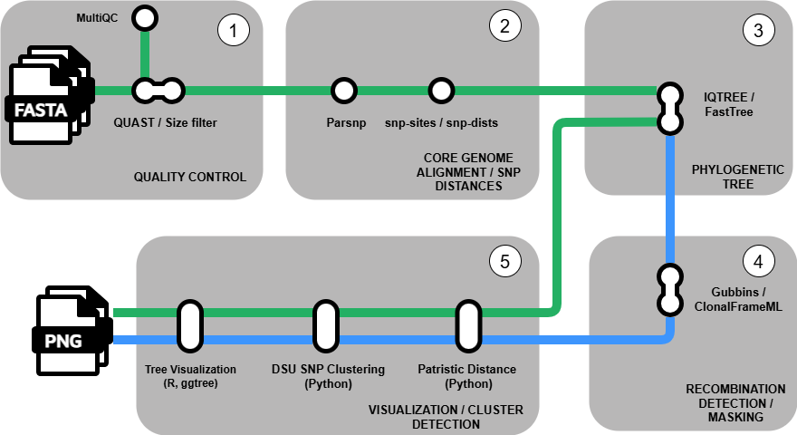

# bacterial-genomics/assemblysnps

[](https://github.com/codespaces/new/bacterial-genomics/assemblysnps)
[](https://github.com/bacterial-genomics/assemblysnps/actions/workflows/nf-test.yml)
[](https://github.com/bacterial-genomics/assemblysnps/actions/workflows/linting.yml)[](https://doi.org/10.5281/zenodo.XXXXXXX)
[](https://www.nf-test.com)

[](https://www.nextflow.io/)
[](https://github.com/nf-core/tools/releases/tag/3.5.2)
[](https://docs.conda.io/en/latest/)
[](https://www.docker.com/)
[](https://sylabs.io/docs/)
[](https://cloud.seqera.io/launch?pipeline=https://github.com/bacterial-genomics/assemblysnps)

## Introduction



**bacterial-genomics/assemblysnps** is a bioinformatics pipeline that generates a core genome alignment, genomic distances and a phlyogenetic tree, intended for bacterial outbreak surveillance.

1. (Optional) QC FASTA assemblies with ([QUAST](https://quast.sourceforge.net/)) and reported with ([`MultiQC`](http://multiqc.info/)). This step can be skipped with `--skip_quast`.

2. Core genome alignment with ([Parsnp](https://harvest.readthedocs.io/en/latest/content/parsnp.html)).

3. Extract SNPs from core genome alignment with [snp-sites](https://sanger-pathogens.github.io/snp-sites/).

4. Compute maximum likelihood tree with [IQTREE2](https://github.com/iqtree/iqtree2) or optionally [FastTree](https://github.com/morgannprice/fasttree) using the `--run_fasttree` parameter.

5. (Optional) Detect and mask recombination loci with [Gubbins](https://nickjcroucher.github.io/gubbins/) or [ClonalFrameML](https://github.com/xavierdidelot/clonalframeml).

6. Generate SNP distance matrices with [snp-dists]() and patristic distances from resulting trees with a [homebrew python script](bin/patristic_distance.py)

7. Automatically annotate SNP clusters using a [homebrew script](bin/outbreak_detection.py) using the [Disjoint Set Union algorithm](https://en.wikipedia.org/wiki/Disjoint-set_data_structure) to iteratively aggregate genomes based on a SNP distance threshold, which may be set using the `--snp_threshold` parameter.

8 Generate a phylogenetic tree graphic (`ggtree/tree.png`) using [ggtrree](https://github.com/YuLab-SMU/ggtree).

## Usage

This pipeline was tested using Nextflow v25.10.4, and should be compatible with Nextflow v26.04.0 if the `NXF_SYNTAX_PARSER` environment variable is set to `v1`. **It has yet to adopt [strict syntax](https://docs.seqera.io/nextflow/strict-syntax)**.
> `export NXF_SYNTAX_PARSER=v1`

> [!NOTE]
> If you are new to Nextflow and nf-core, please refer to [this page](https://nf-co.re/docs/usage/installation) on how to set-up Nextflow. Make sure to [test your setup](https://nf-co.re/docs/usage/introduction#how-to-run-a-pipeline) with `-profile test` before running the workflow on actual data.

First, prepare a samplesheet with your input data that looks as follows:

`samplesheet.csv`:

```csv
sample,fasta
sampleA,sampleA.fasta
sampleB,sampleB.fna.gz
```

> The following input FASTA file extensions are acceptable: `.fasta`, `.fna`, `.fa`, `.fsa`, `.fas`. Files may also be gzipped-compressed and have a `.gz` extension.

> [!NOTE] By default, FASTA files under 1000 bytes will be excluded from the analysis for quality control, a warning message will print to `.nextflow.log` if so. This feature can be modified with the `--min_fasta_size` parameter. This feature may change to minimum assembly length in future releases.

Now, you can run the pipeline using:

```bash
nextflow run bacterial-genomics/assemblysnps \
   -profile <docker/singularity/.../institute> \
   --input samplesheet.csv \
   --outdir <OUTDIR>
```
> [!NOTE] At the moment, some of the modules only have a Singularity container defined.

> [!WARNING]
> Please provide pipeline parameters via the CLI or Nextflow `-params-file` option. Custom config files including those provided by the `-c` Nextflow option can be used to provide any configuration _**except for parameters**_; see [docs](https://nf-co.re/docs/usage/getting_started/configuration#custom-configuration-files).

## Credits

bacterial-genomics/assemblysnps was originally written by @Ethan-Hetrick,@chrisgulvik, **[TODO: insert other authors here]**

We thank the following people for their extensive assistance in the development of this pipeline:

**[TODO: insert other contributors here]**

## Contributions and Support

If you would like to contribute to this pipeline, please see the [contributing guidelines](.github/CONTRIBUTING.md).

## Citations

<!-- TODO nf-core: Add citation for pipeline after first release. Uncomment lines below and update Zenodo doi and badge at the top of this file. -->
<!-- If you use bacterial-genomics/assemblysnps for your analysis, please cite it using the following doi: [10.5281/zenodo.XXXXXX](https://doi.org/10.5281/zenodo.XXXXXX) -->

<!-- TODO nf-core: Add bibliography of tools and data used in your pipeline -->

An extensive list of references for the tools used by the pipeline can be found in the [`CITATIONS.md`](CITATIONS.md) file.

This pipeline uses code and infrastructure developed and maintained by the [nf-core](https://nf-co.re) community, reused here under the [MIT license](https://github.com/nf-core/tools/blob/main/LICENSE).

> **The nf-core framework for community-curated bioinformatics pipelines.**
>
> Philip Ewels, Alexander Peltzer, Sven Fillinger, Harshil Patel, Johannes Alneberg, Andreas Wilm, Maxime Ulysse Garcia, Paolo Di Tommaso & Sven Nahnsen.
>
> _Nat Biotechnol._ 2020 Feb 13. doi: [10.1038/s41587-020-0439-x](https://dx.doi.org/10.1038/s41587-020-0439-x).
