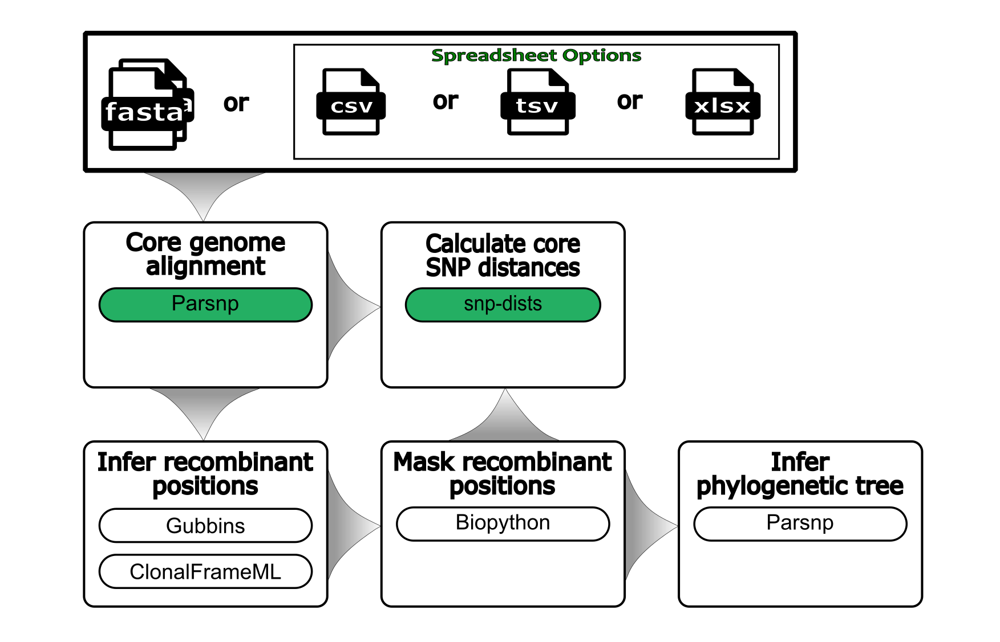

<h1>
  <picture>
    <source media="(prefers-color-scheme: dark)" srcset="images/wf-assembly-snps_logo_dark.png">
    
  </picture>
</h1>



> _General schematic of the steps in the workflow_

## Requirements

- [Nextflow](https://www.nextflow.io/docs/latest/getstarted.html#installation) `(>=22.04.3)`
- [Docker](https://docs.docker.com/engine/installation/) or [Singularity](https://www.sylabs.io/guides/3.0/user-guide/) `(>=3.8.0)`

## Install workflow

```bash
# Load Nextflow
module load nextflow

# Install workflow
nextflow pull bacterial-genomics/wf-assembly-snps -r main

# Make workflow accessible
export PATH=$PATH:~/.nextflow/assets/bacterial-genomics/wf-assembly-snps
```

## Setup Singularity environment variables - For Aspen Cluster

```bash
# Add to $HOME/.bashrc
SINGULARITY_BASE=/scicomp/scratch/$USER

export SINGULARITY_TMPDIR=$SINGULARITY_BASE/singularity.tmp
export SINGULARITY_CACHEDIR=$SINGULARITY_BASE/singularity.cache
export NXF_SINGULARITY_CACHEDIR=$SINGULARITY_BASE/singularity.cache

mkdir -pv $SINGULARITY_TMPDIR $SINGULARITY_CACHEDIR
```

Reload .bashrc

```bash
source ~/.bashrc
```

# Run Workflow

Before running workflow on new data, the workflow should be ran on the built-in test data to make sure everything is working properly. It will also download all dependencies to make subsequent runs much faster.

```bash
module load nextflow

nextflow run \
  bacterial-genomics/wf-assembly-snps \
  -r main \
  -profile singularity,test \
  --outdir results
```

## Usage

To minimize typing all of the parameters above, a bash script was created for UGE HPCs. It can take FastA files from selected directory OR if FastA files not found in that directory, it will look in subdirectories for FastA files. If an OUTPUT_DIRECTORY is not specified, the OUTPUT_DIRECTORY will default to where you launch the script.

```bash
# Parsnp
run_Parsnp.uge-nextflow INPUT_DIRECTORY OUTPUT_DIRECTORY
```

Example analysis using Nextflow command:

```bash
nextflow run \
  bacterial-genomics/wf-assembly-snps \
  -r main \
  -profile singularity \
  --input INPUT_DIRECTORY \
  --outdir OUTPUT_DIRECTORY \
  --snp_package parsnp
```

### Help menu of all options

```bash
nextflow run bacterial-genomics/wf-assembly-snps -r main --help
```
